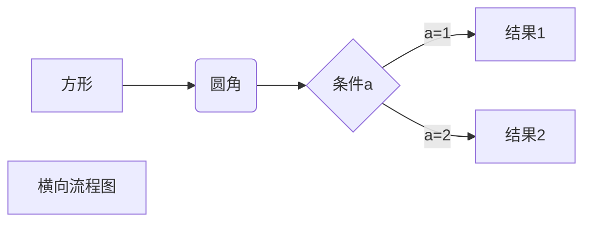
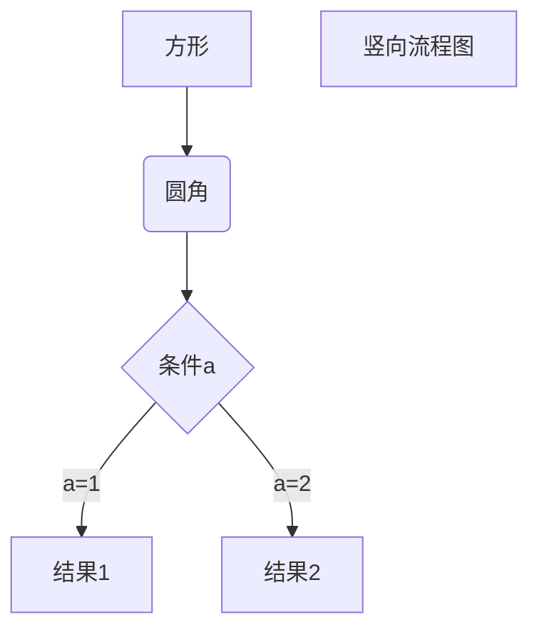
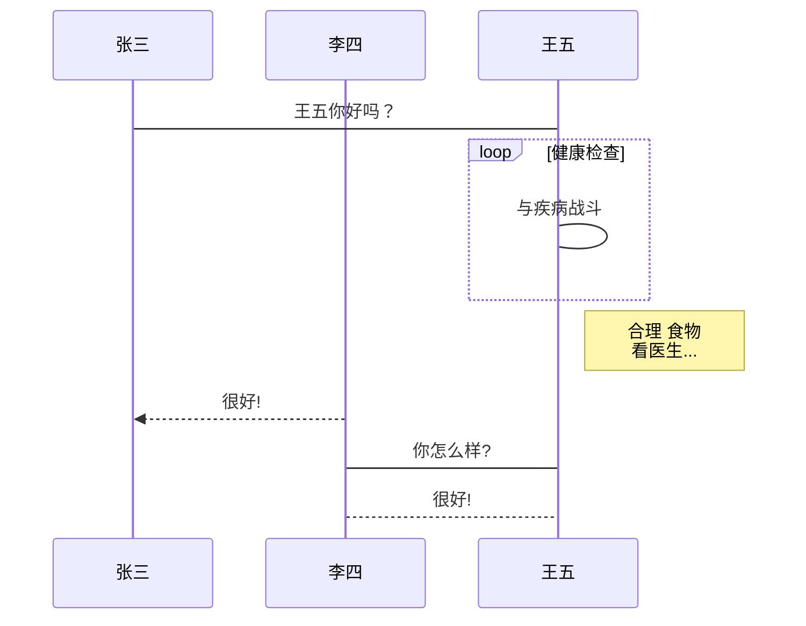
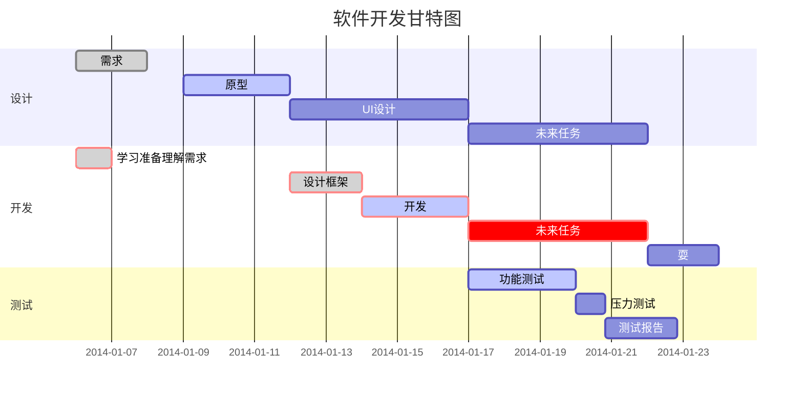

>Markdown是一种轻量级标记语言，创始人为约翰·格鲁伯（英语：John Gruber）。 它允许人们使用易读易写的纯文本格式编写文档，然后转换成有效的XHTML（或者HTML）文档。这种语言吸收了很多在电子邮件中已有的纯文本标记的特性。
>
>由于Markdown的轻量化、易读易写特性，并且对于图片，图表、数学式都有支持，许多网站都广泛使用Markdown来撰写帮助文档或是用于论坛上发表消息。 如GitHub、Reddit、Diaspora、Stack Exchange、OpenStreetMap 、SourceForge、简书等，甚至还能被使用来撰写电子书。
>
>Markdwon可以转换多种格式，如HTML 、Word、图像、PDF、Epub 等多种格式的文档。
>
>Markdown 编写的文档后缀为 **.md**, **.markdown**。
>
>Markdown的高效率编辑文本使得开发人员不用再费尽心思去对文章进行排版，因此受到了青睐。
>
>支持Markdown的编辑器有很多种，例如VSCode和Typora，甚至Idea中也可以使用。下面就简单的介绍一下Markdown的基础语法。

## 标题

```
几级标题就在前面加几个 “#”,别忘了之间的空格
# 一级标题
## 二级标题
### 三级标题
#### 四级标题
##### 五级标题
###### 六级标题
如下例所示
```

# 一级标题

## 二级标题

### 三级标题

#### 四级标题

##### 五级标题

###### 六级标题


## 字体

```
在需要斜体的内容上左右两侧加上一个 * 即可完成斜体
*今天星期天*
如下例所示
```

*今天星期天*

```
在需要加粗的内容上左右两侧加上两个 * 即可完成加粗
**今天星期天**
如下例所示
```

**今天星期天**

```
在需要加粗同时斜体的内容上左右两侧加上三个 * 即可完成斜体加粗
***今天星期天***
如下例所示
```

***今天星期天***

```
在需要删除线的内容上左右两侧加上两个 - 即可添加删除线
~~今天星期天~~
如下例所示
```

~~今天星期天~~


## 引用

```
引用 使用” >加上想要引用的内容 “即可完成引用
嵌套引用 在引用中使用 “>加上想要引用的内容”
如下例所示
```

> 加上想要引用的内容
>
> > 加上想要引用的内容

## 分割线

```
三个及以上的 - 或 * 即可构成分割线
如下例所示
```

---

****


## 超链接

```
[百度](https://www.baidu.com)
如下例所示，百度为超链接显示的文本，括号后为超链接指向的url
```

[百度](https://www.baidu.com)


## 图片

```


如下例所示
```


##  列表

```
无序列表使用 - + * 任何一种都可以（符号与文字之间有空格）
有序列表直接数字加上点就可以
如下例所示
```

#### 无序列表

- 无序列表使用 - + * 任何一种都可以（符号与文字之间有空格）
- “- 列表内容”
- “+ 列表内容”
- “* 列表内容”
  - 列表还可以嵌套 
    - 列表还可以嵌套

#### 有序列表

1. 直接数字加上点就可以
2. 直接数字加上点就可以
3. 直接数字加上点就可以


## 表格

```text
一个三行三列的表格如下所示：

|表头|表头|表头|
|:-|:-:|-:|
|内容|内容|内容|
|内容|内容|内容|

其中第二行中 :- 为居左 :-:为居中 -:为居右
如下例所示
```

| 表头 | 表头 | 表头 |
| ---- | :--: | ---: |
| 内容 | 内容 | 内容 |
| 内容 | 内容 | 内容 |


## 代码

````text
`单行代码左右两侧分别用一个反引号包括起来 反引号是在英文输入法状态下按住shift加上Tab上面的键 `
代码块则是左右两侧分别用三个反引号包括起来
单行代码：`代码`
代码块：
``` java
代码 
```
代码块可以指定语言，当然也可以不去指定
如下例所示
````

`代码`

```
代码
```


## 流程图

> 在Typora中画流程图，此处引用了菜鸟教程 -> markdown教程 -> markdown高级技巧中的一篇笔记

**1、横向流程图源码格式：**

````

````


**2、竖向流程图源码格式：**

````

````


**3、标准流程图源码格式：**

````
```flow
st=>start: 开始框
op=>operation: 处理框
cond=>condition: 判断框(是或否?)
sub1=>subroutine: 子流程
io=>inputoutput: 输入输出框
e=>end: 结束框
st->op->cond
cond(yes)->io->e
cond(no)->sub1(right)->op
```
````

```flow
st=>start: 开始框
op=>operation: 处理框
cond=>condition: 判断框(是或否?)
sub1=>subroutine: 子流程
io=>inputoutput: 输入输出框
e=>end: 结束框
st->op->cond
cond(yes)->io->e
cond(no)->sub1(right)->op
```

**4、标准流程图源码格式（横向）：**

````
```flow
st=>start: 开始框
op=>operation: 处理框
cond=>condition: 判断框(是或否?)
sub1=>subroutine: 子流程
io=>inputoutput: 输入输出框
e=>end: 结束框
st(right)->op(right)->cond
cond(yes)->io(bottom)->e
cond(no)->sub1(right)->op
```
````

```flow
st=>start: 开始框
op=>operation: 处理框
cond=>condition: 判断框(是或否?)
sub1=>subroutine: 子流程
io=>inputoutput: 输入输出框
e=>end: 结束框
st(right)->op(right)->cond
cond(yes)->io(bottom)->e
cond(no)->sub1(right)->op
```

**5、UML时序图源码样例：**

````
```sequence
对象A->对象B: 对象B你好吗?（请求）
Note right of 对象B: 对象B的描述
Note left of 对象A: 对象A的描述(提示)
对象B-->对象A: 我很好(响应)
对象A->对象B: 你真的好吗？
```
````

```sequence
对象A->对象B: 对象B你好吗?（请求）
Note right of 对象B: 对象B的描述
Note left of 对象A: 对象A的描述(提示)
对象B-->对象A: 我很好(响应)
对象A->对象B: 你真的好吗？
```

**6、UML时序图源码复杂样例：**

````
```sequence
Title: 标题：复杂使用
对象A->对象B: 对象B你好吗?（请求）
Note right of 对象B: 对象B的描述
Note left of 对象A: 对象A的描述(提示)
对象B-->对象A: 我很好(响应)
对象B->小三: 你好吗
小三-->>对象A: 对象B找我了
对象A->对象B: 你真的好吗？
Note over 小三,对象B: 我们是朋友
participant C
Note right of C: 没人陪我玩
```
````

```sequence
Title: 标题：复杂使用
对象A->对象B: 对象B你好吗?（请求）
Note right of 对象B: 对象B的描述
Note left of 对象A: 对象A的描述(提示)
对象B-->对象A: 我很好(响应)
对象B->小三: 你好吗
小三-->>对象A: 对象B找我了
对象A->对象B: 你真的好吗？
Note over 小三,对象B: 我们是朋友
participant C
Note right of C: 没人陪我玩
```

**7、UML标准时序图样例：**

````

````


**8、甘特图样例：**

````

````

